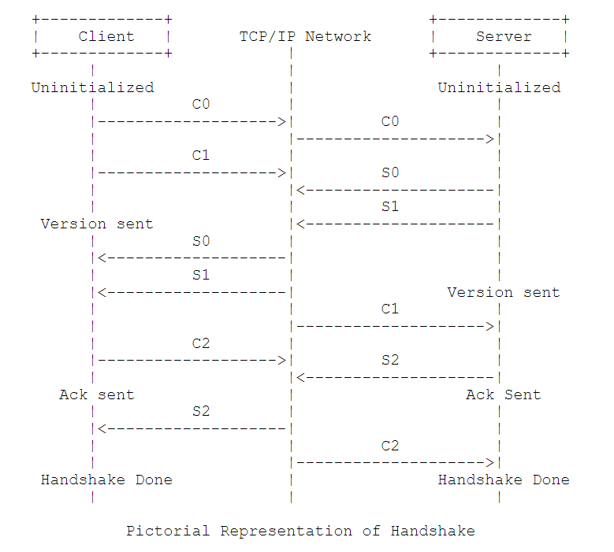

# 介绍

Adobe’s Real Time Messaging Protoco（RTMP）基于 TCP [RFC0793]  半私有协议，主要用户与服务端双向视频消息传输。  的视频流传输。双向消息多路复用服务，该服务旨在在一对视频流之间传送视频，音频和数据消息的并行流以及相关的定时信息。 交流的同行。 实现通常为不同类别的消息分配不同的优先级，这可能会在传输能力受到限制时影响消息排队到基础流传输的顺序。 本备忘录描述了实时消息协议的语法和操作

# 术语

对照 https://tools.ietf.org/html/rfc2119

# 定义

Payload:   数据包中包含的数据，例如音频样本或压缩视频数据。 

Packet:  数据包由固定的报头和有效载荷数据组成。 一些基础协议可能需要对数据包进行封装才能定义

Port ：“传输协议用来在给定主机内的多个目的地之间进行区分的抽象。TCP/ IP协议使用小的正整数来标识端口。”  

Transport address :   数据包从源传输地址传输到目标传输地址

Message stream: 消息在其中流动的逻辑通信通道

Message stream ID: 每条消息都有一个与之关联的ID，以标识消息在其中流动

Chunk: 消息的一部分。 在通过网络发送消息之前，将消息分成较小的部分并进行交织。 这些块确保跨多个流的所有消息按时间戳排序的端到端传递。

Chunk stream: 允许块在特定方向上流动的逻辑通信通道。 块流可以从客户端传播到服务器，然后反向传输。

Chunk stream ID:  每个块都有一个与之关联的ID，以标识它所流入的块流

Multiplexing: 将单独的音频/视频数据转换为一个连贯的音频/视频流，从而可以同时传输多个视频和音频的过程。

DeMultiplexing: 反向复用的过程，其中将交错的音频和视频数据组合在一起以形成原始音频和视频数据。

Remote Procedure Call (RPC):  一种允许客户端或服务器在对等端调用子例程或过程的请求。

Metadata:  有关数据的描述。 电影的元数据包括电影标题，持续时间，创建日期等。

Application Instance: 客户端通过发送连接请求与之连接的服务器上的应用程序实例。

Action Message Format (AMF):  一种紧凑的二进制格式，用于序列化ActionScript对象图。 AMF有两个版本：AMF 0 [AMF0]和AMF 3 [AMF3]。

# 字节顺序，对齐方式和时间格式

所有整数字段均按网络字节顺序传送，字节零是所示的第一个字节，而位零是字或字段中的最高有效位。 此字节顺序通常称为big-endian。 传输顺序在Internet协议[RFC0791]中进行了详细描述。 除非另有说明，否则本文档中的数字常数以十进制（10为基数）为单位。

除非另有说明，否则RTMP中的所有数据都是字节对齐的。 例如，一个16位字段可能处于奇数字节偏移处。 在指示填充的地方，填充字节的值应为零。

RTMP中的时间戳以相对于未指定历元的整数毫秒为单位给出。 通常，每个流将从0时间戳开始，但这不是必需的，只要两个端点在该时期达成一致即可。 请注意，这意味着跨多个流（尤其是来自单独主机的流）的任何同步都需要RTMP之外的一些其他机制。

由于时间戳长为32位，因此每49天，17小时，2分钟和47.296秒滚动一次。 因为允许流连续运行（可能连续数年），所以RTMP应用程序在处理时间戳时应使用序列号算法[RFC1982]，并且应能够处理环绕。 例如，一个应用程序假设所有相邻时间戳都在2 ^ 31-1毫秒之内，因此10000在4000000000之后，而3000000000在4000000000之后。

相对于先前时间戳，时间戳增量也被指定为毫秒的无符号整数。 时间戳增量可能为24或32位长。

# RTMP块流

本部分指定实时消息协议块流（RTMP块流）。 它为更高级别的多媒体流协议提供多路复用和打包服务。

尽管RTMP块流旨在与实时消息协议一起使用（第6节），但它可以处理任何发送消息流的协议。 每个消息都包含时间戳和有效负载类型标识。 RTMP块流和RTMP一起适用于多种音频视频应用，从一对一和一对多的实时广播到视频点播服务再到交互式会议应用

当与可靠的传输协议（例如TCP [RFC0793]）一起使用时，RTMP块流可跨多个流提供按时间戳排序的所有消息的端到端交付保证。 RTMP块流不提供任何优先级划分或类似形式的控制，但是可以由更高级别的协议用来提供这种优先级划分。 例如，实时视频服务器可能会选择发送慢速客户端的视频消息，以确保根据发送时间或确认每个消息的时间及时接收音频消息。

RTMP块流包括其自己的带内协议控制消息，还提供了用于更高级别协议的机制来嵌入用户控制消息。

# 讯息格式

可以分为多个块以支持多路复用的消息格式取决于更高级别的协议。 但是消息格式应该包含以下字段，这些字段是创建块所必需的。

Timestamp:  消息的时间戳。 该字段可以传输4个字节。

Length: 消息有效负载的长度。 如果无法删除消息头，则应将其包括在长度中。 该字段在块头中占用3个字节。 

Type Id:  一系列类型ID保留用于协议控制消息。 这些传播信息的消息由RTMP块流协议和更高级别的协议处理。 所有其他类型的ID可供更高级别的协议使用，并且被RTMP Chunk Stream视为不透明值。 实际上，在RTMP块流中，没有任何要求将这些值用作类型。 所有（非协议）消息都可以是同一类型，或者应用程序可以使用此字段来区分同时记录的曲目而不是类型。 该字段在块头中占用1个字节

Message Stream ID:  消息流ID可以是任意值。 多路复用到同一块流上的不同消息流将根据其消息流ID进行多路分解。 除此之外，就RTMP块流而言，这是一个不透明的值。 该字段在块头中以小尾数格式占用4个字节。

# 握手  Handshake

RTMP连接从握手开始。 握手不同于协议的其余部分。 它由三个静态大小的块组成，而不是由带有标头的可变大小的块组成。 客户端（发起连接的端点）和服务器分别发送相同的三个块。 为了说明起见，这些块在由客户端发送时将被指定为C0，C1和C2。 服务器发送的S0，S1和S2。

## 握手顺序 Handshake Sequence

握手始于客户端发送C0和C1块。 
客户端必须等到收到S1后再发送C2。 
客户端必须等到收到S2后再发送其他数据。 
服务器必须等到收到C0后再发送S0和S1，也可以等到C1之后。 
服务器必须等到收到C1后再发送S2。 
服务器必须等到收到C2后再发送其他数据。

## C0 and S0 格式

 0 1 2 3 4 5 6 7
 +-+-+-+-+-+-+-+-+
 |   version     |
 +-+-+-+-+-+-+-+-+ 
  C0 and S0 bits

**以下是C0 / S0数据包中的字段：**

Version (8 bits): 在C0中，此字段标识客户端请求的RTMP版本。 在S0中，此字段标识服务器选择的RTMP版本。 本规范定义的版本为3。值0-2是较早的专有产品使用的不赞成使用的值。默认值为0； 

4-31保留用于将来的实现； 和不允许使用32-255（以使RTMP与基于文本的协议区分开，后者始终以可打印字符开头）。 不能识别客户端请求的版本的服务器应以3响应。客户端可以选择降级为版本3或放弃握手。

## C1 and S1 格式

0                 10                 20                  30    (count bit) 
0 1 2 3 4 5 6 7 8 9 0 1 2 3 4 5 6 7 8 9 0 1 2 3 4 5 6 7 8 9 0 1
+-+-+-+-+-+-+-+-+-+-+-+-+-+-+-+-+-+-+-+-+-+-+-+-+-+-+-+-+-+-+-+-+
|                        time (4 bytes)                         |
+-+-+-+-+-+-+-+-+-+-+-+-+-+-+-+-+-+-+-+-+-+-+-+-+-+-+-+-+-+-+-+-+
|                        zero (4 bytes)                         |
+-+-+-+-+-+-+-+-+-+-+-+-+-+-+-+-+-+-+-+-+-+-+-+-+-+-+-+-+-+-+-+-+
|                        random bytes                           |
+-+-+-+-+-+-+-+-+-+-+-+-+-+-+-+-+-+-+-+-+-+-+-+-+-+-+-+-+-+-+-+-+
|                         random bytes                          |
|                            (cont)                             |
|                             ....                              |
+-+-+-+-+-+-+-+-+-+-+-+-+-+-+-+-+-+-+-+-+-+-+-+-+-+-+-+-+-+-+-+-+
                         C1 and S1 bits

Time (4 bytes):  该字段包含一个时间戳，该时间戳应该用作该端点发送的所有将来块的纪元。 可以是0，也可以是任意值。 为了同步多个块流，端点可能希望发送其他块流的时间戳的当前值。

Zero (4 bytes):  该字段必须全为0。

Random data (1528 bytes): 该字段可以包含任意值。 由于每个端点都必须区分对它发起的握手的响应和对等端发起的握手的响应，因此该数据应该发送足够随机的信息。 但是，不需要加密安全的随机性甚至动态值

## C2 and S2 格式

C2和S2数据包的长度为1536个字符byte，几乎分别是S1和C1的回波，由以下字段组成：

Time (4 bytes):  该字段必须包含对等体在S1（对于C2）或C1（对于S2）中发送的时间戳。

Time2（4个字节）：此字段必须包含时间戳，在该时间戳下读取对等方发送的先前数据包（s1或c1）。

## 握手顺序

**下面描述了握手图中提到的状态：**

Uninitialized:  在此阶段发送协议版本。 客户端和服务器都未初始化。 客户端在数据包C0中发送协议版本。 如果服务器支持该版本，则它将发送S0和S1作为响应。 如果不是，则服务器通过采取适当的措施来响应。 在RTMP中，此操作将终止连接。

Version Sent:  在未初始化状态之后，客户端和服务器都处于“已发送版本”状态。 客户端正在等待数据包S1，服务器正在等待数据包C1。服务器发送数据包S2。 然后状态变为“已发送确认”。 发送确认客户端和服务器分别等待S2和C2。 完成握手：客户端和服务器交换消息。

# 消息块 Chunking

握手后，连接将多路复用一个或多个块流。 每个块流从一个消息流中携带一种类型的消息。 创建的每个块都有一个与之关联的唯一ID，称为块流ID。 块通过网络传输。 传输时，每个块必须在下一个块之前完整发送。 在接收器端，基于块流ID将块组装为消息。

分块允许将较高级别协议中的大型消息分解为较小的消息，例如，防止大型低优先级消息（例如视频）阻止较小的高优先级消息（例如音频或控制）。

分块还允许以较小的开销发送小消息，因为块头包含信息的压缩表示，否则该信息必须包含在消息本身中。

块大小是可配置的。 可以使用“设置块大小”控制消息进行设置 较大的块大小可减少CPU使用率，但也会进行较大的写入，这可能会延迟带宽较低的连接上的其他内容。 较小的块不利于高比特率流传输。 每个方向的块大小均独立保持。

## 块格式 Chunk Format

每个块均由 标题(hander) 和 数据(data) 组成。 标头本身包含三个部分：

+--------------+----------------+--------------------+--------------+ 
| Basic Header | Message Header | Extended Timestamp |  Chunk Data  |  
+--------------+----------------+--------------------+--------------+
|                                                    |
|<------------------- Chunk Header ----------------->|

   

Basic Header (1 to 3 bytes):   该字段编码块流ID和块类型。 块类型确定编码的消息头的格式。 长度完全取决于块流ID，它是一个可变长度字段。

Message Header (0, 3, 7, or 11 bytes):   该字段对有关正在发送的消息的信息进行编码（无论是全部还是部分）。 可以使用块头中指定的块类型来确定长度。

Extended Timestamp (0 or 4 bytes):   在某些情况下，取决于“块消息”标头中的编码时间戳或时间戳增量字段，此字段存在。 

 Chunk Data (variable size):   该块的有效负载，最大为配置的最大块大小。

## 基础头信息 Chunk Basic Header

块基本头对块流ID和块类型进行编码（在下图中由fmt字段表示）。 块类型确定编码的消息头的格式。 块基本标头字段可以是1、2或3个字节，具体取决于块流ID（chunk stream ID）。

一个实现应该使用可以保存ID的最小表示。 ？

该协议最多支持65597个ID为3-65599的流。 
ID 0、1和2被保留。 
值0表示2字节形式，其ID范围为64-319（第二个字节+ 64）。 
值1表示3字节形式，其ID范围为64-65599（（第三个字节）* 256 +第二个字节+ 64）。 
3-63范围内的值表示完整的流ID。 
值为2的块流ID保留用于低级协议控制消息和命令。

块基本头中的0-5位（最低有效位）表示块流ID。

块流ID 2-63可以在此字段的1字节版本中编码。

 0 1 2 3 4 5 6 7 （bits）
+-+-+-+-+-+-+-+-+
|fmt|   cs id   |
+-+-+-+-+-+-+-+-+
Chunk basic header 1

**块流ID 64-319可以头文件的2字节形式编码。 ID计算为（第二个字节+ 64）。**

 0                   10            
 0 1 2 3 4 5 6 7 8 9 0 1 2 3 4 5
+-+-+-+-+-+-+-+-+-+-+-+-+-+-+-+-+
|fmt|     0     |   cs id - 64  |
+-+-+-+-+-+-+-+-+-+-+-+-+-+-+-+-+
	Chunk basic header 2

**块流ID 64-65599可以在此字段的3字节版本中进行编码。 ID计算为（（第三个字节）* 256 +（第二个字节）+ 64）。**

 0 1 2 3 4 5 6 7 8 9 0 1 2 3 4 5 6 7 8 9 0 1 2 3
+-+-+-+-+-+-+-+-+-+-+-+-+-+-+-+-+-+-+-+-+-+-+-+-+
|fmt|     1     |        cs id - 64             |
+-+-+-+-+-+-+-+-+-+-+-+-+-+-+-+-+-+-+-+-+-+-+-+-+
	Chunk basic header 3

cs id (6 bits):  该字段包含块流ID，取值范围为2-63。 值0和1用于指示此字段的2字节或3字节版本。

fmt (2 bits): 此字段标识“块邮件标题”使用的四种格式之一。 下一节将说明每种块类型的“块消息头”。

cs id - 64 (8 or 16 bits): 该字段包含块流ID减去64。例如，ID 365将由cs id中的1表示，此处由16位301表示。

值64-319的块流ID可以由2字节或3字节形式的标头表示。

## 块信息头 

块消息头有四种不同的格式，由块基础头中的“ fmt”字段选择。 一个实现应该为每个块消息头使用尽可能紧凑的表示形式。

### Type 0
“fmt” = 0("00")
Chunk Message Header  = 11 bytes
这种类型必须在组块流的开始以及流时间戳向后的时候使用。

时间戳（3个字节）：对于类型0块，消息的绝对时间戳在此处发送。 如果时间戳大于或等于16777215（十六进制0xFFFFFF），则此字段务必为16777215，指示存在扩展时间戳字段以对完整的32位时间戳进行编码。 否则，此字段应为整个时间戳
     
 0 1 2 3 4 5 6 7 8 9 0 1 2 3 4 5 6 7 8 9 0 1 2 3 4 5 6 7 8 9 0 1
+-+-+-+-+-+-+-+-+-+-+-+-+-+-+-+-+-+-+-+-+-+-+-+-+-+-+-+-+-+-+-+-+
|                   timestamp                   |message length |
+-+-+-+-+-+-+-+-+-+-+-+-+-+-+-+-+-+-+-+-+-+-+-+-+-+-+-+-+-+-+-+-+
|     message length (cont)     |message type id| msg stream id |
+-+-+-+-+-+-+-+-+-+-+-+-+-+-+-+-+-+-+-+-+-+-+-+-+-+-+-+-+-+-+-+-+
|           message stream id (cont)            |
+-+-+-+-+-+-+-+-+-+-+-+-+-+-+-+-+-+-+-+-+-+-+-+-+ 
     Chunk Message Header - Type 0

### Type 1 

“fmt” = 1("01")
Chunk Message Header  = 7 bytes
类型1块标题的长度为7个字节。 消息流ID不包括在内； 该块采用与前面的块相同的流ID。 消息大小可变的流（例如，许多视频格式）应在每个新消息的第一个块之后使用这种格式
     
0 1 2 3 4 5 6 7 8 9 0 1 2 3 4 5 6 7 8 9 0 1 2 3 4 5 6 7 8 9 0 1
+-+-+-+-+-+-+-+-+-+-+-+-+-+-+-+-+-+-+-+-+-+-+-+-+-+-+-+-+-+-+-+-+
|                timestamp delta                |message length |
+-+-+-+-+-+-+-+-+-+-+-+-+-+-+-+-+-+-+-+-+-+-+-+-+-+-+-+-+-+-+-+-+
|     message length (cont)     |message type id|
+-+-+-+-+-+-+-+-+-+-+-+-+-+-+-+-+-+-+-+-+-+-+-+-+ 
    Chunk Message Header - Type 1

### Type 2

“fmt” = 2("10") 
Chunk Message Header  = 3 bytes
既不包括流ID，也不包括消息长度。 该块与先前的块具有相同的流ID和消息长度。 具有固定大小消息的流（例如，某些音频和数据格式）应在每个消息的第一块之后使用这种格式。

### Type 3

“fmt” = 3("11")

流ID，消息长度和时间戳增量字段不存在。  
此类型的块从相同的块流ID的前一个块中获取值。
当单个消息被分割成块时，消息中除第一个消息外的所有块都应该使用这种类型。 请参见示例2（第5.3.2.2节）。
由大小完全相同，流ID和时间间隔完全相同的消息组成的流应在类型2的一个块之后的所有块中使用此类型。请参见示例1（第5.3.2.1节）。
如果第一条消息和第二条消息之间的增量与第一条消息的时间戳相同，则类型3的块可以立即跟随类型0的块，因为不需要块2的块来注册增量 。 
如果类型3组块紧随类型0组块，则此类型3组块的时间戳增量与类型0组块的时间戳相同。

### 通用标题字段 

块消息头中每个字段的描述：

timestamp delta (3 bytes): 对于fmt=1或fmt=2块，将在此处发送前一个块的时间戳和当前块的时间戳之间的差。 如果增量大于或等于16777215（十六进制0xFFFFFF），则此字段务必为16777215，指示存在扩展时间戳字段以对完整的32位增量进行编码。 否则，该字段应为实际增量。

message length (3 bytes): 对于类型0或类型1块，消息的长度在此处发送。 请注意，这通常与块有效负载的长度不同。 块有效载荷长度是除最后一个块以外的所有块的最大块大小，最后一个块的其余部分（对于小消息，可能是整个长度）。

message type id (1 byte): 对于类型0或类型1块，消息的类型在此处发送。

message stream id (4 bytes): 对于类型0块，将存储消息流ID。 消息流ID以Little-Endian格式存储。 通常，同一块流中的所有消息都将来自同一消息流。 尽管可以将单独的消息流多路复用到相同的块流中，但这使标头压缩的好处无法实现。 但是，如果关闭了一个消息流，然后又打开了另一个消息流，则没有理由不能通过发送新的Type-0块来重用现有的块流。

## 扩展时间戳 Extended Timestamp

Extended Timestamp字段用于编码大于16777215（0xFFFFFF）的时间戳或时间戳增量； 也就是说，对于不适合类型0、1，或2块的24位字段的时间戳或时间戳变化量。 该字段编码完整的32位时间戳或时间戳增量。 通过将类型0块的时间戳字段或类型1或2块的时间戳增量字段设置为16777215（0xFFFFFF）来指示此字段的存在。 当相同块流ID的最新Type 0、1或2块指示存在扩展时间戳字段时，此字段以Type 3块形式出现。

# 协议控制消息 Protocol Control Messages

http://assets.processon.com/chart_image/5dfc3247e4b00cdf4f0ce846.png

RTMP块流将消息类型ID 1、2、3、5和6用于协议控制消息。 这些消息包含RTMP块流协议所需的信息。 这些协议控制消息必须具有消息流ID 0（称为控制流），并以组块流ID 2发送。协议控制消息一接收到就生效； 它们的时间戳将被忽略。

## Set Chunk Size (1)

最大块大小默认为128字节，但是客户端或服务器可以更改此值，并使用此消息更新其对等方。 例如，假设客户端要发送131字节的音频数据，并且块大小为128。在这种情况下，客户端可以将此消息发送到服务器，以通知它现在块大小为131字节。 然后，客户端可以在单个块中发送音频数据。

最大块大小应至少为128个字节，并且必须至少为1个字节。 每个方向的最大块大小独立保持。

## Abort Message (2)

协议控制消息2（中止消息）用于通知对等端是否正在等待块完成消息，然后通过块流丢弃部分接收的消息。 对等方接收块流ID作为此协议消息的有效负载。 当关闭时，应用程序可以发送此消息，以指示不需要进一步处理消息。

块流ID（32位）：此字段保存块流ID，其当前消息将被丢弃。

##  Acknowledgement (3)

客户端或服务器必须在接收到等于窗口大小的字节后，向对等方发送确认。 窗口大小是发送方在未收到接收方确认的情况下发送的最大字节数。 该消息指定序列号，该序列号是到目前为止接收到的字节数。

## Window Acknowledgement Size (5)

客户端或服务器发送此消息，以通知对等方在两次发送确认之间使用的窗口大小。 在发送方发送窗口大小字节之后，发送方期望来自其对等方的确认。 自从上一次发送确认以来，接收方必须在收到指示的字节数后，或者从会话开始时（如果尚未发送确认），在收到指示的字节数后发送确认 。

## Set Peer Bandwidth (6)

客户端或服务器发送此消息以限制其对等方的输出带宽。 接收此消息的对等方通过将已发送但未确认的数据量限制为此消息中指示的窗口大小来限制其输出带宽。 如果窗口大小与发送给该消息发送者的最后一个窗口大小不同，则收到此消息的对等方应以窗口确认大小消息作为响应。

# RTMP Message Formats   

本节指定使用较低级传输层（例如RTMP块流）在网络上的实体之间传输的RTMP消息的格式。 尽管RTMP旨在与RTMP块流一起使用，但它可以使用任何其他传输协议来发送消息。 RTMP块流和RTMP一起适用于多种音频视频应用程序，从一对一和一对多的实时广播到视频点播服务再到交互式会议应用程序。

22page pdf rtmp1